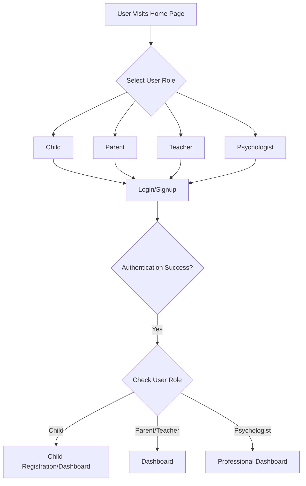
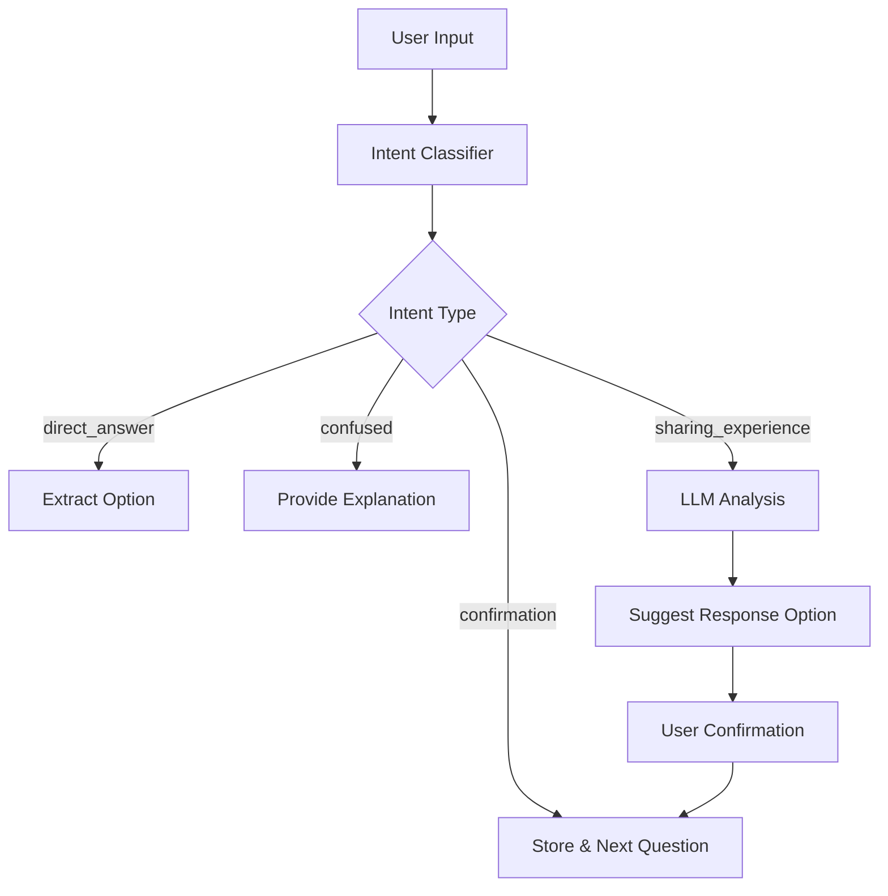

# SDQ Assessment Platform

A comprehensive behavioral assessment platform implementing the Strengths and Difficulties Questionnaire (SDQ) with AI-powered conversational testing and professional review capabilities.

## 🎯 Project Overview

This platform allows children (11-17), parents, teachers, and psychologists to participate in a multi-perspective behavioral assessment process. The system uses conversational AI to guide users through the SDQ questionnaire, analyzes responses from multiple perspectives, and provides professional psychological reviews.

### Key Features

- **Multi-Role Assessment**: Children, parents, teachers, and psychologists each have tailored interfaces
- **Conversational AI Testing**: Natural language processing for intuitive questionnaire completion
- **Intent Classification**: Smart response interpretation with follow-up questions
- **Vector Embeddings**: Advanced response analysis using sentence transformers
- **Professional Review System**: Psychologist dashboard for comprehensive assessment review
- **Real-time Scoring**: Automated SDQ scoring with subscale analysis
- **Secure Data Management**: MongoDB-based data storage with role-based access

## 🏗️ Architecture Overview

### Backend Structure
```
backend/
├── backend_api/          # API endpoints
│   ├── auth.py          # Authentication & user management
│   ├── chat.py          # Conversational testing logic
│   ├── child.py         # Child registration & management
│   ├── review.py        # Psychologist review system
│   ├── score.py         # SDQ scoring algorithms
│   └── test.py          # Test management & submission
├── core/                # Core business logic
│   ├── context_tracker.py    # Conversation context management
│   └── prompt_builder.py     # AI prompt construction
├── db/                  # Database layer
│   ├── mongo_handler.py # MongoDB operations
│   └── vector_store.py  # Vector embedding storage
├── services/            # External services
│   ├── llm_chat.py     # Gemini AI integration
│   └── llm_score.py    # AI-powered scoring
├── utils/               # Utilities
│   └── intent_classifier.py # User intent detection
└── main.py             # FastAPI application entry
```

### Frontend Structure
```
frontend/
├── src/
│   ├── components/      # Reusable UI components
│   │   ├── Chatbox.js  # Conversational interface
│   │   ├── Header.js   # Navigation header
│   │   ├── Login.js    # Authentication component
│   │   └── Navbar.js   # Navigation bar
│   ├── pages/          # Page components
│   │   ├── Home.js           # Landing page
│   │   ├── Test.js           # Assessment interface
│   │   ├── ChildDashboard.js # Child-specific dashboard
│   │   ├── ParentTeacherDash.js # Parent/teacher dashboard
│   │   ├── PsychDash.js      # Psychologist dashboard
│   │   ├── Results.js        # Assessment results
│   │   └── Review.js         # Professional review interface
│   └── App.js          # Main application routing
```

## 🚀 Setup Instructions

### Prerequisites

- **Python 3.8+**
- **Node.js 16+**
- **MongoDB** (local installation or MongoDB Atlas)
- **Gemini API Key** (Google AI Studio)

### Backend Setup

1. **Clone the repository**
   ```bash
   git clone <repository-url>
   cd sdq-assessment-platform
   ```

2. **Set up Python environment**
   ```bash
   cd backend
   python -m venv venv
   
   # On Windows
   venv\Scripts\activate
   
   # On macOS/Linux
   source venv/bin/activate
   ```

3. **Install Python dependencies**
   ```bash
   pip install -r requirements.txt
   ```

4. **Set up environment variables**
   Create a `.env` file in the `backend/` directory:
   ```env
   # LLM Configuration
   LLM_BACKEND=gemini
   GEMINI_API_KEY=your_gemini_api_key_here
   GEMINI_MODEL=gemini-2.0-flash
   
   # Database Configuration (if using MongoDB Atlas)
   MONGODB_URI=mongodb://localhost:27017
   DATABASE_NAME=sdq_test_db
   ```

5. **Start MongoDB**
   - **Local MongoDB**: Start MongoDB service
   - **MongoDB Atlas**: Ensure your connection string is correct in the code

6. **Run the backend server**
   ```bash
   uvicorn main:app --reload --host 0.0.0.0 --port 8000
   ```
   
   The API will be available at `http://localhost:8000`

### Frontend Setup

1. **Navigate to frontend directory**
   ```bash
   cd frontend
   ```

2. **Install dependencies**
   ```bash
   npm install
   ```

3. **Start the development server**
   ```bash
   npm start
   ```
   
   The application will be available at `http://localhost:3000`

### Database Setup

The application will automatically create the required collections:
- `users` - User authentication data
- `children` - Child registration information
- `tests` - Assessment responses and scores
- `reviews` - Professional review documents
- `vector_responses` - Embedded response vectors

## 🔄 Application Flow

### User Journey Overview



### Assessment Process Flow

1. **Child Registration**
   - Child (or adult) registers with basic information
   - System generates unique sharing code
   - Code shared with parent and teacher

2. **Multi-Perspective Testing**
   - Each party (child ≥11, parent, teacher) completes assessment
   - Conversational AI guides through 25 SDQ questions
   - Responses analyzed with intent classification
   - Vector embeddings stored for detailed analysis

3. **Professional Review**
   - Once all parties complete testing, review is generated
   - AI creates preliminary summary
   - Psychologist reviews comprehensive data
   - Professional recommendations provided

4. **Results Access**
   - All parties can access results after professional review
   - Detailed scores and recommendations displayed

### Conversational AI Process

The platform uses sophisticated NLP to make assessments more natural:



## 📡 API Endpoints

### Authentication
- `POST /auth/signup` - User registration
- `POST /auth/login` - User authentication

### Child Management
- `POST /child/register` - Register new child or login existing
- `POST /child/login` - Login with sharing code
- `GET /child/{child_id}` - Get child details
- `GET /child/code/{code}` - Validate sharing code

### Assessment (Conversational)
- `POST /chat/start` - Initialize assessment session
- `POST /chat/respond` - Process user responses with AI
- `POST /chat/confirm-option` - Confirm response selection

### Test Management
- `POST /test/submit` - Submit completed assessment
- `GET /test/summary` - User dashboard data
- `GET /test/results/{child_id}` - Access results
- `GET /test/score/{test_id}` - Get calculated scores

### Professional Review
- `GET /reviews/pending` - Pending reviews for psychologists
- `GET /reviews/completed` - Completed reviews
- `GET /reviews/{child_id}` - Comprehensive review data
- `POST /reviews/submit` - Submit professional review

## 🧠 AI & ML Components

### Intent Classification
The system classifies user intents to provide appropriate responses:
- `direct_answer` - Clear SDQ option choice
- `confirmation` - Agreement with suggestion
- `correction` - Disagreement or clarification
- `confused` - Needs explanation
- `sharing_experience` - Contextual information
- `unclear` - Ambiguous response

### Vector Embeddings
- Uses SentenceTransformer (`all-MiniLM-L6-v2`) for response analysis
- Stores conversation context for professional review
- Enables semantic similarity analysis

### LLM Integration
- **Gemini 2.0 Flash** for conversational responses
- Dynamic prompt building based on user role and age
- Context-aware question explanations

## 🎯 SDQ Scoring System

### Question Banks by Age
- **Ages 2-4**: Simplified behavioral descriptors
- **Ages 5-10**: Standard SDQ questions  
- **Ages 11-17**: Age-appropriate phrasing

### Scoring Algorithm
- **Standard Questions**: Not True (0), Somewhat True (1), Certainly True (2)
- **Reverse Scored**: Questions 7, 14, 20, 21, 25 (reversed)
- **Subscales**: Emotional, Conduct, Hyperactivity, Peer Problems, Prosocial
- **Total Score**: Sum of all subscales (excluding Prosocial)

### Score Interpretation
- **0-15**: Normal range
- **16-19**: Slightly raised
- **20-40**: High/Very high (clinical concern)

## 🔒 Security & Privacy

- **Role-based Access Control**: Users only access appropriate data
- **Data Encryption**: Sensitive information protected
- **Authentication Required**: All endpoints secured except public routes
- **Child Protection**: Special handling for minor data

## 🐛 Troubleshooting

### Common Issues

1. **MongoDB Connection Error**
   ```
   Check MongoDB service is running
   Verify connection string in mongo_handler.py
   ```

2. **Gemini API Error**
   ```
   Verify GEMINI_API_KEY in .env file
   Check API quota and billing
   ```

3. **Vector Embedding Issues**
   ```
   Install sentence-transformers: pip install sentence-transformers
   Check model download (happens on first run)
   ```

4. **Frontend API Connection**
   ```
   Ensure backend is running on port 8000
   Check CORS settings in main.py
   ```

### Development Notes

- **Hot Reload**: Both frontend and backend support hot reloading
- **Database Reset**: Drop collections in MongoDB to reset data
- **API Testing**: Use `/docs` endpoint for FastAPI interactive documentation
- **Logging**: Check console output for detailed error messages

## 📊 Data Models

### Database Schema

The platform uses MongoDB with the following collections and relationships:

```javascript
// users - Authentication and user management
{
  _id: ObjectId, // Primary key
  email: String,
  password_hash: String,
  role: String, // "parent", "teacher", "psychologist"
  created_at: Date
}

// children - Child registration and profile data
{
  _id: ObjectId, // Primary key
  name: String,
  age: Number,
  gender: String, // "female", "male"
  code: String, // Unique sharing code like "E9D09B17"
  email: String,
  registered_on: Date,
  parent_id: ObjectId // Reference to users._id
}

// tests - Assessment responses and scoring
{
  _id: ObjectId, // Primary key
  test_id: String, // Unique test identifier
  age: Number,
  child_name: String,
  child_id: ObjectId, // Reference to children._id
  respondent_type: String, // "parent", "teacher"
  email: String,
  submitted: Boolean,
  confirm_options: Array, // 25 SDQ responses
  vector_responses: Array, // 31 conversation embeddings
  scores: Object, // Calculated SDQ scores
  created_at: Date,
  parent_id: ObjectId // Reference to users._id
}

// reviews - Professional psychological reviews
{
  _id: ObjectId, // Primary key
  child_id: ObjectId, // Reference to children._id
  child_test_id: String,
  parent_test_id: String,
  teacher_test_id: String,
  ai_generated_summary: String, // AI-generated assessment summary
  psychologist_review: String, // Professional review text
  scores: Object, // Consolidated scores from all perspectives
  status: String, // "pending", "reviewed"
  reviewed_by: String, // Psychologist identifier
  submitted_at: Date,
  reviewed_at: Date,
  test_id: ObjectId // Reference to tests._id
}
```

### Database Relationships

```
users (1) ←→ (many) children
children (1) ←→ (many) tests
users (1) ←→ (many) tests
children (1) ←→ (many) reviews
tests (1) ←→ (many) reviews
```

### Collection Sizes & Indexing

- **users**: Indexed on `email` (unique)
- **children**: Indexed on `code` (unique), `parent_id`
- **tests**: Indexed on `test_id` (unique), `child_id`, `email`
- **reviews**: Indexed on `child_id`, `status`

## 🤝 Contributing

1. Fork the repository
2. Create feature branch (`git checkout -b feature/AmazingFeature`)
3. Commit changes (`git commit -m 'Add AmazingFeature'`)
4. Push to branch (`git push origin feature/AmazingFeature`)
5. Open Pull Request


## 🆘 Support

For support and questions:
- Create an issue in the repository
- Check the troubleshooting section above
- Review API documentation at `http://localhost:8000/docs`

---

**Note**: This is a behavioral assessment tool designed for educational and research purposes. Always consult qualified mental health professionals for clinical decisions.
